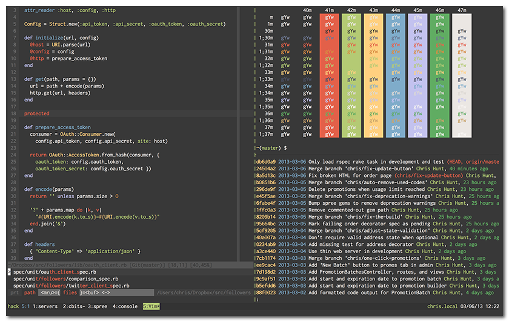
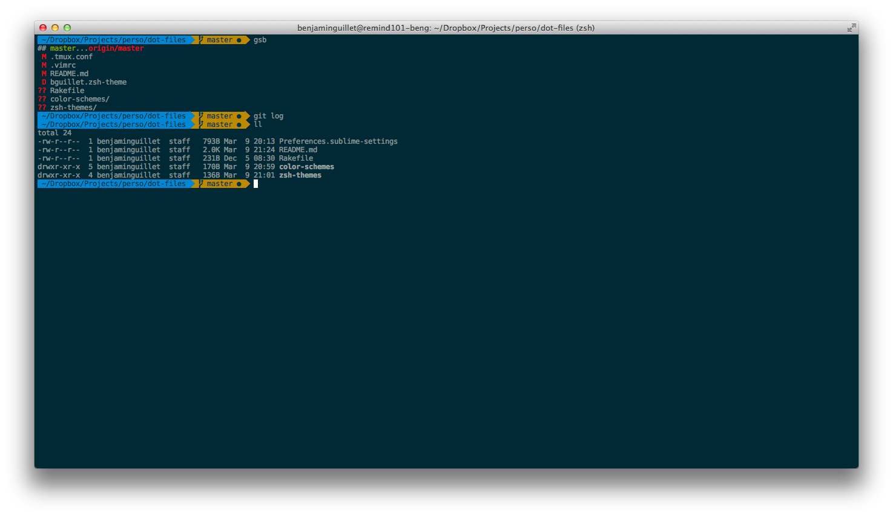

## dot-files
A small compilation and backup of my dot files on OS X 10.9.

It includes:
* Zsh + oh-my-zsh
* My Vim setup (plugins are managed with Vundle)
* My Tmux setup
* My Git setup
* and more...

### Railscasts theme

**Vim** | [Base16](https://github.com/chriskempson/base16-vim), by Chris Kempson

    $ vim ~/.vimrc

      " ~/.vimrc
      Bundle 'chriskempson/base16-vim'

      set background=dark
      colorscheme base16-railscasts

      highlight clear SignColumn
      highlight VertSplit    ctermbg=236
      highlight ColorColumn  ctermbg=237
      highlight LineNr       ctermbg=236 ctermfg=240
      highlight CursorLineNr ctermbg=236 ctermfg=240
      highlight CursorLine   ctermbg=236
      highlight StatusLineNC ctermbg=238 ctermfg=0
      highlight StatusLine   ctermbg=240 ctermfg=12
      highlight IncSearch    ctermbg=0   ctermfg=3
      highlight Search       ctermbg=0   ctermfg=9
      highlight Visual       ctermbg=3   ctermfg=0
      highlight Pmenu        ctermbg=240 ctermfg=12
      highlight PmenuSel     ctermbg=0   ctermfg=3
      highlight SpellBad     ctermbg=0   ctermfg=1

**Sublime** | [Railscasts Extended](https://github.com/jzelenkov/sublime-railscasts-extended), by Jev Zelenkov

**iTerm2** | [Base16](https://github.com/chriskempson/base16-iterm2), by Chris Kempson

    $ open color-schemes/railscasts/base16-railscasts-custom.dark.256.itermcolors

**Tmux**

    $ vi ~/.tmux.conf

    # ~/.tmux.conf
    set -g default-terminal "screen-256color"
    set -g status-bg colour235
    set -g status-fg white

    set-window-option -g window-status-current-fg black
    set-window-option -g window-status-current-bg green

    set -g pane-border-fg colour235
    set -g pane-border-bg black
    set -g pane-active-border-fg green
    set -g pane-active-border-bg black

**Zsh** | [agnoster](https://github.com/robbyrussell/oh-my-zsh/blob/master/themes/agnoster.zsh-theme), by Isaac Wolkerstorfer

Requires a powerline-patched font. I use DejaVu Sans Mono for Powerline, 12pt.

### Solarized

**iTerm2**

    $ open color-schemes/solarized/solarized_dark.itermcolors

**Zsh** | [agnoster](https://github.com/robbyrussell/oh-my-zsh/blob/master/themes/agnoster.zsh-theme), by Isaac Wolkerstorfer

Requires a powerline-patched font. I use DejaVu Sans Mono for Powerline, 12pt.

